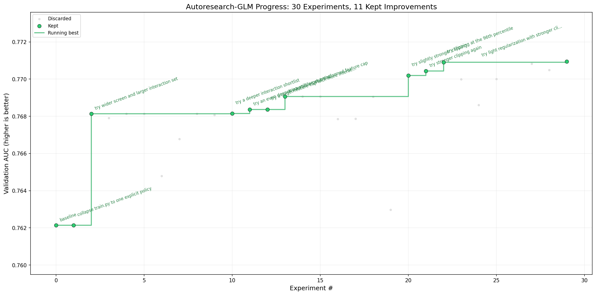

# autoresearch-glm

`autoresearch-glm` is a minimal fork of [Andrej Karpathy's `autoresearch`](https://github.com/karpathy/autoresearch).

The original repo studies autonomous code-editing loops on a tiny GPT training benchmark. This fork keeps that spirit, but pivots the benchmark to tabular binary classification with a logistic GLM and autonomous feature search.

The canonical benchmark is the Taiwan credit card default dataset from UCI. The March 2026 `v1` line established that fixed TaiwanCredit GLM benchmark, and the April 2026 `v2` line keeps the same dataset and metric while expanding the feature-search machinery. That keeps the repo grounded in a real credit-scoring problem while preserving the tiny, fixed-benchmark character of the upstream project.

Compared with the upstream GPT benchmark, this fork has a much smaller dependency footprint and no GPU requirement. It is a plain CPU-first Python benchmark with NumPy, pandas, `ucimlrepo`, and Matplotlib for analysis.

The idea is simple: give an AI agent a small but real tabular modeling setup and let it experiment autonomously. It modifies the feature-policy code, runs the benchmark, checks whether validation AUC improved, keeps or discards the change, and repeats. You wake up later to a log of experiments and, ideally, a better GLM.

Instead of touching a large framework, you mainly program the `program.md` file that sets the operating rules for the agent, while the agent edits `train.py`.

That makes the fork about one concrete problem:

**autonomous fixed-budget feature discovery for GLMs on tabular data**



## Current frontier

This README describes the current `v2` line of the project: the XGBoost-seeded GLM feature-search version with pruning and explicit interaction screening.

As of Apr 8, 2026, the best kept policy on the fixed TaiwanCredit validation split is:

- commit `ea71156`
- validation AUC `0.781135`
- 36 final GLM terms after pruning

That frontier uses:

- raw identity terms plus XGBoost-seeded spline terms as the main-effect path
- post-fit pruning to keep the final GLM compact
- residual-based two-way interaction screening over the top 12 screened raw variables
- a constrained depth-2 XGBoost fit to propose explicit rectangle interaction indicators

The current kept interaction frontier adds two surviving rectangle terms to the GLM while staying within a 36-feature budget.

## How it works

The repo is deliberately kept small and only really has three files that matter:

- `prepare.py` — fixed benchmark setup, TaiwanCredit download/cache, validation split, and AUC metric. Not modified during normal experiments.
- `train.py` — the single file the agent edits. It contains the current feature-search policy, compact GLM fitting code, and evaluation logic.
- `program.md` — baseline instructions for one agent. Point your agent here and let it go. This file is edited and iterated on by the human.

Inside that small surface, the current `train.py` policy already supports a useful set of compact tabular feature-search components:

- variable screening by marginal correlation
- optional tail clipping for raw variables
- `identity` raw terms
- `xgb_bin` piecewise-constant main effects derived from XGBoost depth-1 stumps
- `xgb_spline` continuous truncated-linear main effects seeded from the same stump splits
- residual-based interaction screening plus explicit rectangle interaction terms
- L1/L2 regularization and a post-fit pruning pass

By design, the benchmark is narrow and fixed:

- binary classification only
- logistic regression / GLM only
- validation AUC only

One run evaluates one current policy. The point is not to build AutoML. The point is to keep the code small enough that an agent can rewrite the benchmark itself while still working on a classical modeling surface that matters.

## Why this is interesting

Classical tabular modeling still contains a hard combinatorial core. Even when the final estimator is just logistic regression, the choice of variables, transformations, caps, and interactions can dominate performance. In domains like credit scoring, fraud, AML, and loss forecasting, that search space has historically been important, labor-intensive, and difficult to systematize.

`autoresearch-glm` applies the autoresearch loop to exactly that surface. The agent edits a small piece of experiment code, runs a short benchmark, observes a single metric, and keeps only changes that actually help.

Using TaiwanCredit as the default example makes the benchmark concrete. It is a compact, classical binary credit dataset with exactly the sort of variable handling questions GLM workflows care about: screening, monotone-friendly transforms, nonlinear corrections, and tightly controlled interaction search.

## Quick start

Requirements:

- Python 3.12+
- internet access the first time `prepare.py` fetches TaiwanCredit from UCI

```bash
# 1. Create the project virtualenv
python3.12 -m venv .venv

# 2. Install the package and dependencies
.venv/bin/pip install -e .

# 3. Prepare the fixed TaiwanCredit benchmark
.venv/bin/python prepare.py

# 4. Manually run a single experiment
.venv/bin/python train.py
```

If the above commands work, your setup is ready and you can go into autonomous research mode.

`prepare.py` fetches TaiwanCredit through `ucimlrepo`, builds the fixed train/validation split, and caches the prepared arrays. There is no PyTorch stack, no tokenizer, and no GPU dependency. If you can run a normal scientific Python environment, you can usually run this fork.

The current agent workflow assumes the repo-local `.venv` is the canonical environment and that subsequent commands use `.venv/bin/python`.

If you want the cache inside the repo instead of `~/.cache/autoresearch-glm`, set:

```bash
export AUTORESEARCH_GLM_CACHE=.cache/autoresearch-glm
```

## Running the agent

Simply spin up your Claude, Codex, or whatever agent you want in this repo, then prompt something like:

```text
Hi have a look at program.md and let's kick off a new experiment! 
```

The `program.md` file is essentially a super lightweight skill. It tells the agent what it can edit, what it should optimize, how to log experiments, and when to keep or revert a change.

The intended loop is:

1. `prepare.py` stays fixed.
2. The agent reads `program.md`.
3. The agent edits `train.py`.
4. The agent runs `.venv/bin/python train.py`.
5. The agent keeps or discards the code change based on `val_auc`.

`train.py` should represent one current policy, not an internal sweep over many configs.

## Project structure

```text
prepare.py      fixed benchmark setup and runtime utilities
train.py        feature policy, GLM fit, evaluation (agent modifies this)
program.md      agent instructions
analysis.ipynb  experiment analysis notebook
pyproject.toml  dependencies
```

## Current feature machinery

The benchmark intentionally keeps the final estimator fixed as a logistic GLM, but `train.py` now contains a richer feature-policy surface than the initial raw baseline.

### XGBoost-seeded main effects

The current code fits shallow XGBoost depth-1 trees as feature-discovery infrastructure, not as the final model.

- `xgb_bin` turns the discovered stump split locations into a compact piecewise-constant univariate feature.
- `xgb_spline` turns those same discovered split locations into truncated linear bases, giving a continuous piecewise-linear main effect.
- `identity` keeps the raw clipped variable available alongside these nonlinear corrections.

In practice, `xgb_spline` became the primary main-effect path. It consistently outperformed the raw-only baseline and remained better than the tested `xgb_bin` variants on the current TaiwanCredit benchmark.

### Post-fit pruning

After the candidate main-effect and interaction terms are selected and standardized, the code fits the GLM once, ranks terms by absolute coefficient magnitude, prunes weak terms, and re-standardizes the reduced design.

This pruning pass was one of the key improvements in the current frontier. The best kept configuration uses `PRUNE_KEEP = 36`.

### XGBoost interaction screening

The current interaction path is explicitly residual-based:

1. Fit the current main-effect GLM.
2. Compute the residual left by that fit.
3. Coarsely score raw variable pairs with a FAST-style interaction score on the residual.
4. Send only the top screened pairs into a constrained depth-2 XGBoost model.
5. Convert the discovered pairwise regions into explicit GLM rectangle indicator terms.

The important recent change was widening the interaction source pool from the tiny early screen to the top 12 screened raw variables. That finally produced surviving rectangle terms and lifted the best kept validation AUC to `0.781135`.

## Recent empirical notes

The latest search loop established a few practical conclusions that are useful if you continue experimenting:

- `xgb_spline` is the main nonlinear workhorse and should be treated as the default main-effect path.
- `xgb_bin` is still available and useful as an experimental piecewise-constant option, but it has not beaten the current spline frontier.
- broader pre-prune candidate pools at 45 or 50 features were worse than the current `FEATURE_CAP = 40` setup.
- coefficient-threshold pruning tied or underperformed the `keep36` pruning rule.
- increasing spline-knot budgets above 6 only tied the old frontier and did not beat it.
- interaction screening mattered only after broadening the raw pair source pool; once widened, `INTERACTION_CAP = 4` produced the current best kept model.

## Design choices

- Single file to modify. The agent should mainly touch `train.py`. This keeps the scope manageable and diffs reviewable.
- Fixed benchmark. The data split and metric stay fixed in `prepare.py`, so experiments remain directly comparable.
- Single scalar objective. Validation AUC is the only score that matters.
- Self-contained and lightweight. No GPU, no distributed stack, no giant config system, and no platform-specific training complexity.

This fork has a much lower barrier to entry than the upstream GPT benchmark. It is ready to try on normal laptops and CPU boxes, and it opens a different research direction: autonomous feature discovery for interpretable GLM workflows.

## v1 scope (March 2026)

Version 1 was the March 2026 line of the project. It established the fixed TaiwanCredit benchmark and kept the problem intentionally narrow:

- binary classification only
- logistic regression / GLM only
- validation AUC only
- compact feature search inside `train.py`

No multiclass support, no regression support, no deep learning, no feature platform, and no large framework abstractions.

## v2 scope (April 2026)

Version 2 keeps the same fixed benchmark, but upgrades the feature-search machinery beyond the original March raw-only baseline:

- binary classification only
- logistic regression / GLM only
- validation AUC only
- XGBoost-seeded `xgb_bin` and `xgb_spline` main effects
- residual-based XGBoost interaction screening with explicit rectangle terms
- compact feature search inside `train.py`

No multiclass support, no regression support, no deep learning, no feature platform, and no large framework abstractions.
